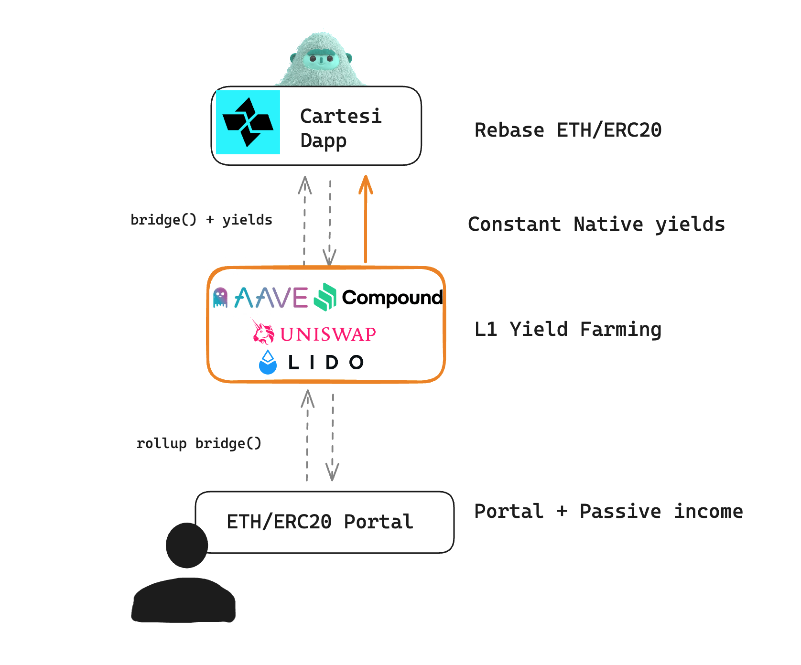
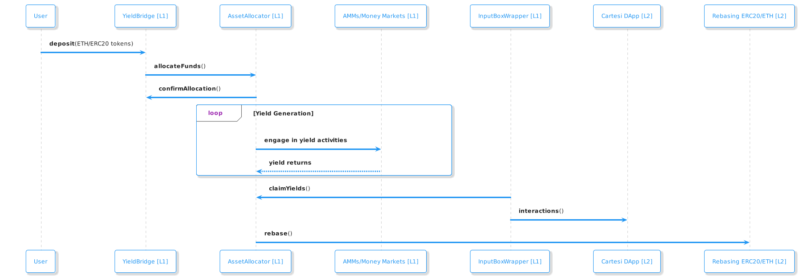

# Cartesi Native Yields



**Cartesi Native Yields**

This repository contains the code for the Cartesi Native Yields module, written in Python. The module enhances the Cartesi Input Box by integrating a series of smart contracts that function as an alternative ERC20 Portal. This new portal bridges tokens between the base layer and Cartesi while simultaneously generating yield from the tokens held in the Input Box on the base layer.

**Objective**

The primary objective is to **enhance capital efficiency and utility** for ETH and ERC20 tokens within Cartesi DApps, all while ensuring their instant availability on the origin chain.

**Impact**

This module empowers users’ tokens to generate passive yields through staking and liquidity provision on L1, thereby boosting capital utilization. It offers compounded yields for liquidity providers, creating a more efficient and attractive ecosystem for Cartesi DApps.

**Overview**

The Cartesi Rollup Native L1-L2 Yields module is a groundbreaking enhancement for Cartesi DApps. It significantly improves the capital efficiency and utility of ETH and ERC20 tokens within the Cartesi ecosystem.

Traditionally, bridging tokens into a Cartesi App involved depositing them into a Deposit Box, which then communicated the deposit amount to the rollup, ready for use in the L2 DApp. However, this approach left tokens idle in the ERC20 Portal, not generating any additional value beyond their utility in L2. Our module transforms this process by creating a new type of Deposit Box that, behind the scenes, stakes and participates in liquidity provision within on-chain staking and T-bill protocols.

**Module Structure**

This module includes the following components:

• **[YieldBridge](src/YieldBridge.sol) [Solidity]:** Solidity smart contracts designed to deposit any ERC20 token, manage allocations/claims in the Asset Allocator, and communicate updated balances to the InputBox.

• **[AssetAllocator](src/AssetAllocator.sol) [Solidity]:** A contract responsible for allocating funds across different money markets, AMMs, and other yield-generating contracts. It provides a unified interface that standardizes operations such as opening positions, adding and removing liquidity, claiming rewards, and more. Each yield-generating protocol (e.g., money markets, on-chain staking platforms) requires a custom implementation using the AssetAllocator standard interface. An AssetAllocator implementation for [Morpho Blue](https://risk.morpho.org/) is included in this deliverable.

• **[InputBoxWrapper](src/InputBoxWrapper.sol) [Solidity]:** A wrapper used in front of the Input Box to automate any L1 actions needed to claim yields. It acts as a pre/post-deposit hook in the InputBox, ensuring seamless integration.

• **[StreamRebaseToken](cartesi-dapp/dapp/streamrebasetoken.py) [Python]:** An extension of the Streamable Token contract developed in a previous grant, incorporating a rebasing mechanism to reflect yields generated on L1.

Additionally we provide a fully working Cartesi dapp that allows to deposit StreamRebaseToken, send Streams and withraw tokens and any reward generated on L1 in Morpho Blue. We also provide tests for the smart contracts and dapp.

Finally we provide a demo script that showcase the full functionality of the module.

### Yield generation and token rebasing diagram



## Install

To run the code you need to have forge installed. You can install it by following the instructions [here](https://book.getfoundry.sh/getting-started/installation).

You also need to have python installed version 3.10 or higher and node.js installed version 18.12.0 or higher.

## Contracts

### Install and build the smart contracts:

```shell
forge install
forge build
```

### Test the smart contracts:

```shell
forge test
```

## Python dapp

### Install the python dapp:

```shell
cd cartesi-dapp
pip install -r requirements.txt
pip install -r requirements-test.txt
```

### Test the python dapp:

```shell
python -m unittest discover -s ./tests
```

## Demo

The demo script provides a complete end-to-end demonstration of the Cartesi Native Yields module. It automates the deployment of all necessary smart contracts, including the deployment of Morpho Blue, and creates test tokens which are then deposited into the YieldBridge. The script simulates yield generation through Morpho Blue, along with typical user interactions. Finally, the demo illustrates how these generated yields are propagated back to the Cartesi DApp, where they can be utilized.

To run the the demo you need to have cartesi cli installed. You can install it by following the instructions [here](https://docs.cartesi.io/cartesi-rollups/1.5/development/cli-commands/).

You also need to install the dependencies in the scripts folder:

```shell
cd scripts
yarn install
```

Then simply run the demo script:

```shell
chmod +x demo.sh
./demo.sh
```

### Expected output

```shell
[DEMO] yarn run v1.22.22
[DEMO] $ node ./build/index.js
[DEMO] Deploying InputBoxWrapper...
[DEMO] InputBoxWrapper deployed at: 0x59b670e9fA9D0A427751Af201D676719a970857b
[DEMO] Deploying YieldBridge...
[DEMO] YieldBridge deployed at: 0x4ed7c70F96B99c776995fB64377f0d4aB3B0e1C1
[DEMO] Setting YieldBridge on InputBoxWrapper...
[DEMO] YieldBridge set on InputBoxWrapper
[DEMO] Deploying test tokens...
[DEMO] LoanToken deployed at: 0xa85233C63b9Ee964Add6F2cffe00Fd84eb32338f
[DEMO] CollateralToken deployed at: 0x4A679253410272dd5232B3Ff7cF5dbB88f295319
[DEMO] Deploying and configuring Morpho...
[DEMO] Morpho deployed at: 0x7a2088a1bFc9d81c55368AE168C2C02570cB814F
[DEMO] IrmMock deployed at: 0x09635F643e140090A9A8Dcd712eD6285858ceBef
[DEMO] OracleMock deployed at: 0xc5a5C42992dECbae36851359345FE25997F5C42d
[DEMO] Setting OracleMock price...
[DEMO] Enabling IRM and LLTV on Morpho...
[DEMO] Creating market on Morpho...
[DEMO] Finding market ID...
[DEMO] Market ID: 0x7a337277428e449e2d8972887441fcd77a4bbf11a0748e3edf780d93411c3e08
[DEMO] Deploying AssetAllocator...
[DEMO] AssetAllocator deployed at: 0x1613beB3B2C4f22Ee086B2b38C1476A3cE7f78E8
[DEMO] Setting AssetAllocator on YieldBridge...
[DEMO] Claiming admin on InputBoxWrapper...
[DEMO] Input added to 0x59b670e9fA9D0A427751Af201D676719a970857b
[DEMO] Input added to 0x59b670e9fA9D0A427751Af201D676719a970857b
[DEMO] Input added to 0x59b670e9fA9D0A427751Af201D676719a970857b
[DEMO] YieldBridge:  0x4ed7c70F96B99c776995fB64377f0d4aB3B0e1C1
[DEMO] InputBoxWrapper:  0x59b670e9fA9D0A427751Af201D676719a970857b
[DEMO] AssetAllocator:  0x1613beB3B2C4f22Ee086B2b38C1476A3cE7f78E8
[DEMO] Setting balance and approving loanToken...
[DEMO] Depositing ERC20 tokens into YieldBridge...
[DEMO] Inspecting Dapp balance after deposit...
[DEMO] Dapp balance after deposit:  200.0 WETH
[DEMO] Simulating Morpho activity and APY...
[DEMO] Increasing time...
[DEMO] Repaying Morpho loan...
[DEMO] Triggering token rebase...
[DEMO] Inspecting Dapp balance after Morpho Blue rebase...
[DEMO] Dapp balance after deposit:  232.291685987562576149 WETH
[DEMO] Withdrawing from InputBoxWrapper...
[DEMO] Input added to 0x59b670e9fA9D0A427751Af201D676719a970857b
[DEMO] Getting and executing vouchers...
[DEMO] Balance after voucher execution: 232.291685987562576149 WETH
[DEMO] Done in 173.67s.
```
